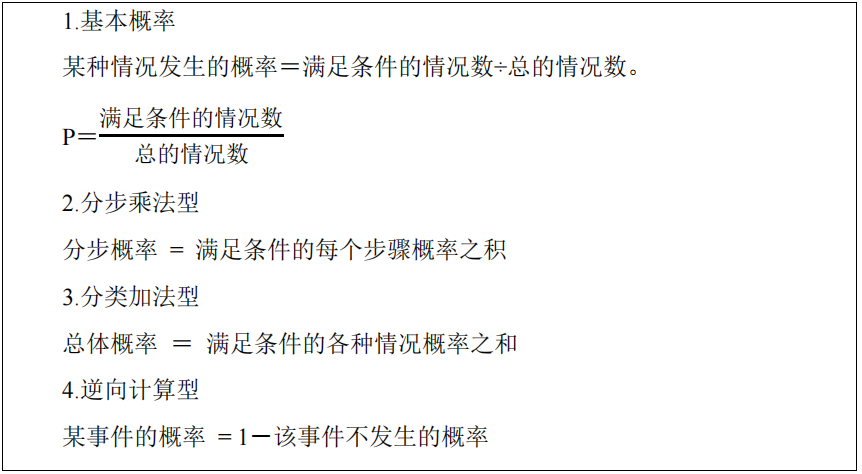
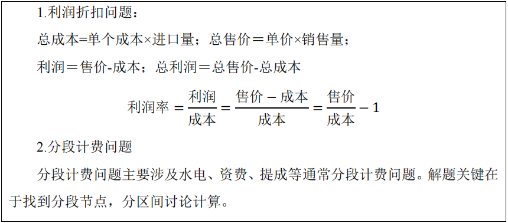
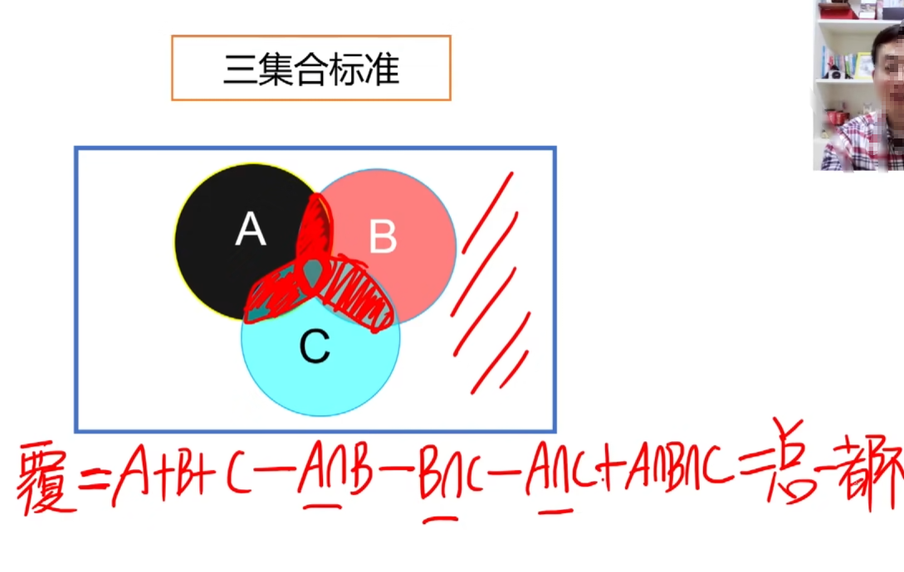
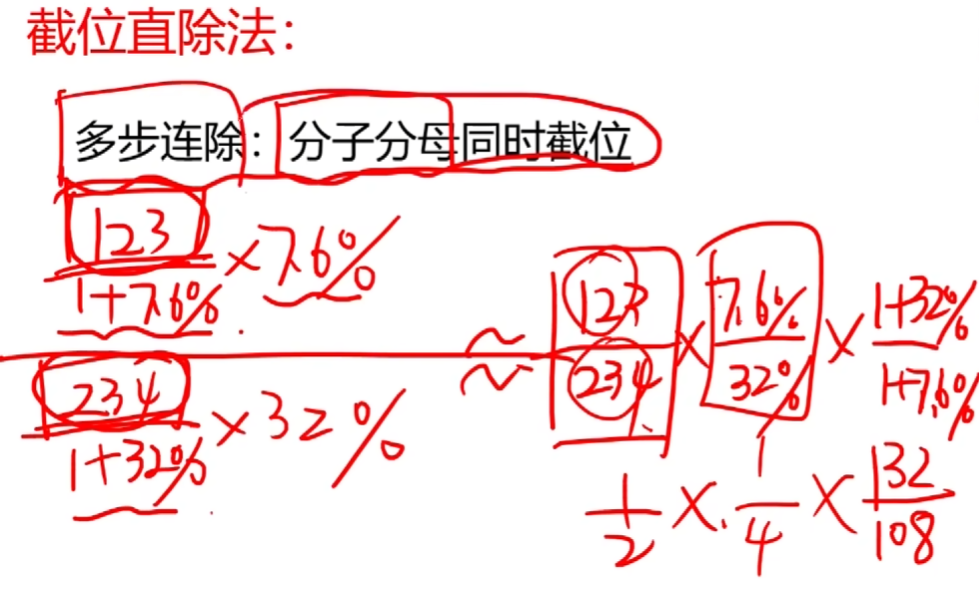
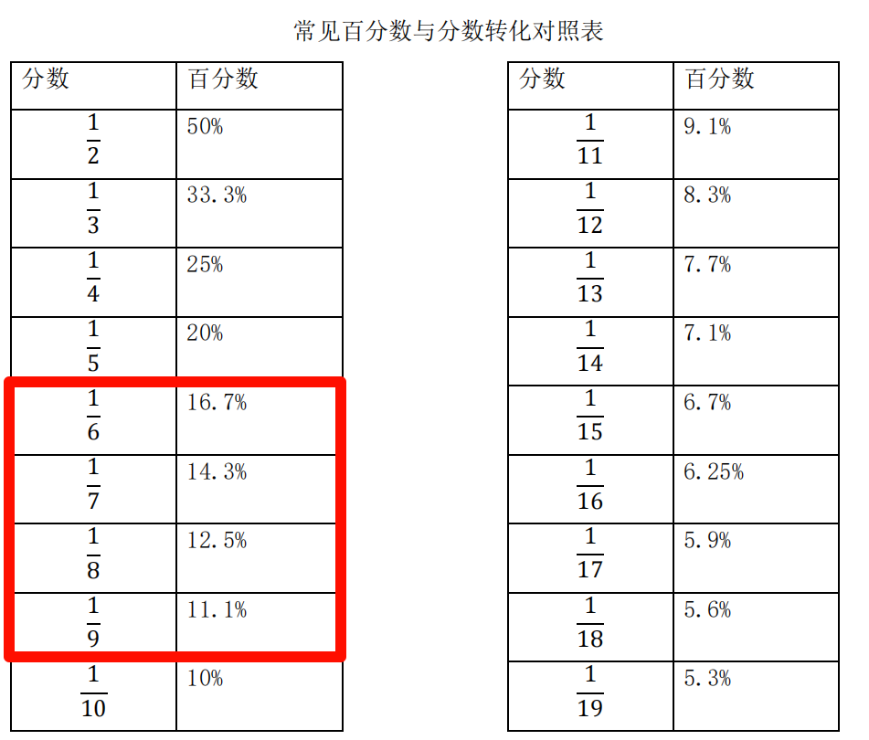
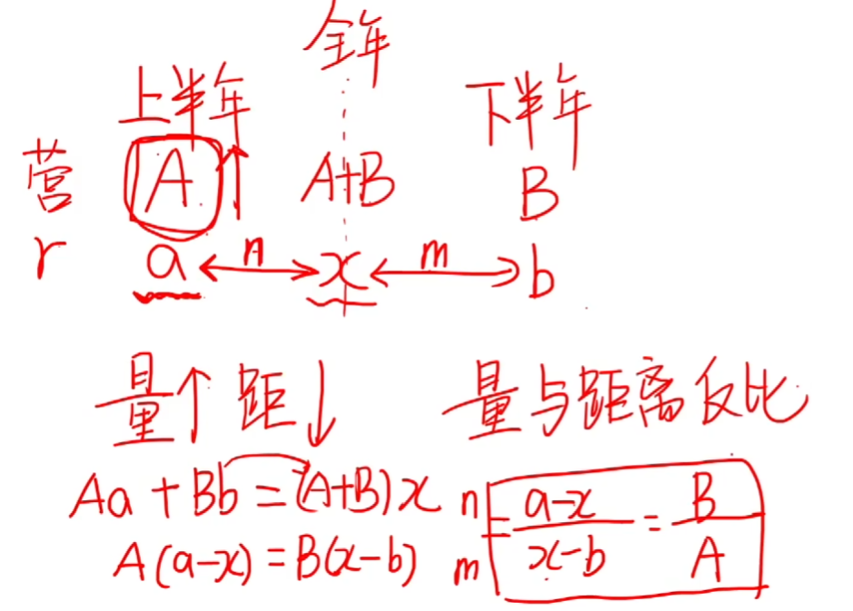
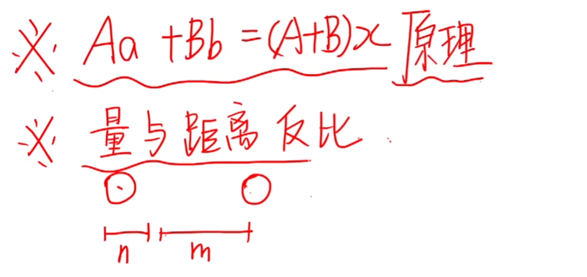

# 数量关系

## 带入排除法

## 数字特性法

## 整除特性

## 方程法

## 不定方程

****

## 工程问题

### 赋值法和方程法

## 行程问题

****

## 排列组合

## 概率问题

## 经济利润问题

## 最值问题

## 容斥问题

## 几何问题

## 年龄问题

# 资料分析 

## 增长率

## 年均增长量

****

## 年均增长率

## 同比和环比

## 比重

## 顺差和逆差

## 五年计划

# 速算技巧

## 截位直除法

## 估算法

## 特殊分数

## 分数比较      

## 增长率相关

## 基期量和现期量 

## **间隔增长率** 

## 混合增长率

## 年均增长率

## 平方数与立方数

## 增长量

## 增长量的比较

## 比重

## 基期比重

****

## 两期比重变化

## 两期比重差

## 基期倍数

## 平均值增长率

